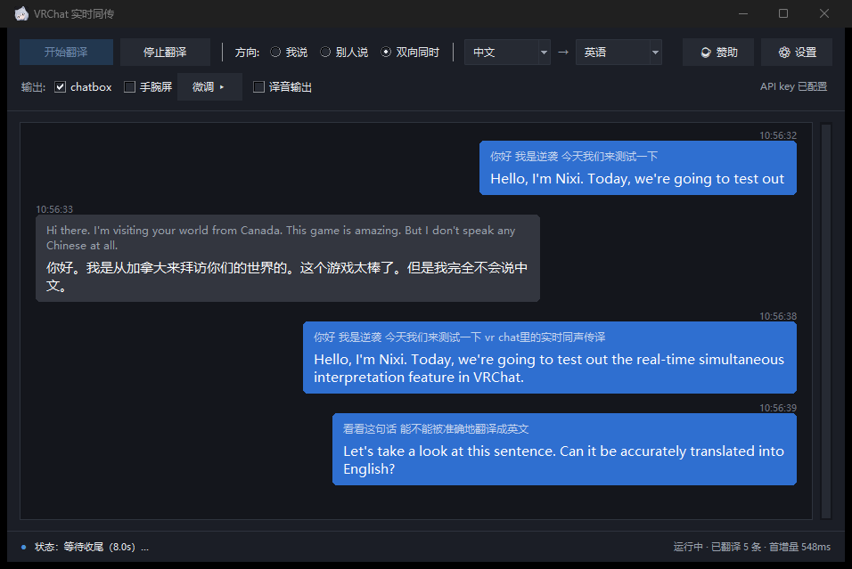

> **English** | [中文](README.md)

# VRChat Live Interpretation

[](https://github.com/nixi-agent/vrchat-livetranslate/actions/workflows/ci.yml)
[](https://github.com/nixi-agent/vrchat-livetranslate/releases/latest)
[](#1-prerequisites)
[](#1-prerequisites)
[](LICENSE)

Real-time simultaneous interpretation inside VRChat: capture your microphone / game audio →
Alibaba Cloud Bailian real-time interpretation model → translation goes to the **chatbox bubble** and a
**VR wrist display**, with an optional path that feeds the translated voice back into a virtual
microphone so the other person **hears it directly**.



---

> 🧭 **This document has two kinds of readers**
>
> - **Just want the exe**: no Python, no command line needed. Anything mentioning `.venv\Scripts\python.exe`,
>   `run_*.bat`, or `--xxx` flags is **source-install only** — skip it; every feature you need is in the GUI.
> - **Running from source**: everything below applies to you.

## Interface language

The UI is available in **Simplified Chinese**, **English**, **日本語**, **한국어** and
**Русский**. It follows your Windows display language by default, and you can switch it
manually in **⚙ Settings**. **A restart is required for the change to take effect.**

## What it can do

| Feature | Status | Details |
|---|---|---|
| ① I speak → **chatbox bubble** | ✅ Implemented, on by default | Microphone → end-to-end speech translation → first incremental delta sent immediately, then a snapshot every 2 seconds, and the final version always sent at end of sentence |
| ② Others speak → **VR wrist display** | ✅ Implemented | Captures VRChat's playback output (WASAPI loopback) → translates into Chinese → renders to a SteamVR overlay, **pushed to the screen as soon as there's an update** |
| ③ I speak → **translated voice into their ears** | ✅ Implemented, off by default | The model outputs translated audio directly → resampled to 48 kHz → written to a virtual sound card → picked up as your VRChat microphone. Requires your own virtual sound card (VoiceMeeter / VB-Cable etc.) |
| ④ I speak → **type instead of talking** | ✅ Implemented, on by default | Input box in the bottom bar, **Enter sends**: use the keyboard instead of the microphone when you don't want to talk. The translation goes through the **exact same** downstream as ① (bubble / wrist display); with "Audio output" ticked it also **speaks the translation via TTS** into the virtual sound card (the other person hears it) |

---

## 0. Fastest start: download the ready-made exe

Grab **`VRChatLiveTranslate.exe`** from
**[Releases](https://github.com/nixi-agent/vrchat-livetranslate/releases/latest)**
(**single file, no install, no console window**) and double-click it.

- You still need your own **Alibaba Cloud Bailian API key**: paste and save it in "⚙ Settings"
- Config and logs live in `%APPDATA%\vrchat-livetranslate` (works even if the exe sits in a read-only folder)
- Want a portable build (config travels with the exe) → put an **empty `portable.txt`** next to the exe
- If an older version left `config.yaml` / `logs/` next to the exe, the first run **migrates them automatically** to the new location; the original files are not deleted

### Does it auto-update?

It **checks automatically**, but **never installs on its own** — whether and when to upgrade is always your call:

- On every launch it quietly checks once in the background; if the check fails (e.g. no network) it doesn't bother you, just logs it
- When a new version is found you get a dialog with three choices:
  - **Update now** → downloads automatically (about a minute or two); when done, click "Restart and update now" to switch immediately;
    or click "Update later" and it swaps in when you next close the app — the next launch is the new version
  - **Next time** → no more popups this run; it checks again on the next launch
  - **Skip this version** → ignores this version; you'll be told about the next one
- Download failed → you can retry, or click "Open the download page" in the window and grab it from Releases yourself
- Want to check when there's no popup → "⚙ Settings → Software update → Check for updates"
- Updating **never touches your config or API key**; after a successful update the next launch tells you so

**Running from source**: none of the above applies — just `git pull` in the repo (clicking "Update now" in a source run tells you the same thing).

Want to read the source / build it yourself / hack on it → start from section 1 below.

---

## 1. Prerequisites

1. **Windows 10 / 11** (uses WASAPI and SteamVR)
2. **Python 3.11** (3.12 untested; make sure to tick *Add python.exe to PATH* during install) — *ignore this if you only use the exe*
   <https://www.python.org/downloads/release/python-3119/>
3. **VRChat**: enable OSC in settings (`OSC enabled: True`) and set chat bubble visibility to **Everyone**
4. **SteamVR** — only needed for the "others speak → wrist display" feature
5. **Alibaba Cloud Bailian API key** (individual real-name verification is enough)

## 2. Install (from source)

Double-click **`setup.bat`** (creates `.venv` + installs dependencies, about 1–2 minutes).

Manual equivalent:

```bat
python -m venv .venv
.venv\Scripts\python.exe -m pip install --upgrade pip
.venv\Scripts\python.exe -m pip install -r requirements.txt
```

## 3. Configure the API key

> 🔑 No Bailian account yet? **[Sign up for Alibaba Cloud Bailian ▸](https://www.aliyun.com/minisite/goods?userCode=q8nma978)**

Sources are tried in the order below — **the first hit wins**:

| Priority | Source | How to set |
|---|---|---|
| 1 | Key saved in the GUI | Paste and save in "⚙ Settings → API key" (stored in `%USERPROFILE%\.vrchat-livetranslate\api_key.txt`) |
| 2 | Environment variable | `setx DASHSCOPE_API_KEY "sk-your-key"` (**takes effect only in a newly opened terminal**) |
| 3 | Bailian CLI config | `bl auth login --api-key "sk-your-key"` (requires `npm install -g bailian-cli`), read from `%USERPROFILE%\.bailian\config.json` |

**The key is only read from these three places — never written into project files or `config.yaml`.**

> 🔒 **Commit-safety**: the repo ships with credential scanning. Run `install_secret_guard.bat` once to install the
> pre-commit hook, and any commit containing `sk-...` / `gho_...` / `AKIA...` / `Bearer ...` / hardcoded secrets
> is blocked outright (script: `scripts/check_no_secrets.py`).
> Manual full scan: `python scripts/check_no_secrets.py --once`
> Why: once a key lands in git history, deleting the file doesn't remove it — you'd have to rewrite history.
> Better to stop it before commit.

## 4. Self-check

**Exe users**: launch it and confirm three things —

1. In "⚙ Settings", none of the three device dropdowns is empty (`Microphone` / `VRChat audio` / `Audio output`)
2. The API key status shows **configured** (otherwise clicking it takes you to the sign-up page)
3. Tick `chatbox`, click "Start translation", say one sentence into the mic → the translation appears in the bubble

**Source installs**: double-click **`run_selfcheck.bat`**. It does four things in order; the first 3 need neither a microphone nor VRChat:

1. Module import check (engine / session / overlay / chatbox / merger)
2. Reads the API key once and prints it masked (confirms the priority order)
3. Renders one wrist-display frame offline (does not take over SteamVR)
4. Runs the bundled test audio through the full pipeline (Chinese → English, into the chatbox)

If VRChat is running, the bubble should show:

```
Hello, I'm Nixi. Today, we're going to test out the real-time simultaneous interpretation feature in VRChat.
```

**Run the self-check before filing a bug.**

---

## 5. Usage

### GUI (recommended)

**Double-click the exe**, or on a source install double-click **`run_gui.bat`** — same window either way
(Tkinter, standard library only, zero extra dependencies, opens instantly).

| Area | Contents |
|---|---|
| Top row | `Start translation` / `Stop translation`, direction radio (`I speak` / `Others speak` / `Both at once`), language-pair dropdown (source → target), `☕ Sponsor` and `⚙ Settings` on the right |
| Second row | `Output:` checkboxes for `chatbox` / `wrist display` / `audio output`, plus the `Fine-tune ▸` button; on the far right the API key status (plain text `API key configured` when set, **otherwise a clickable "⚠ No API key · sign up for Bailian ▸"**) |
| Chat area | Blue bubbles on the right = what I said, gray bubbles on the left = what others said; two lines per bubble — **original in small text on top, translation in large text below**; scrollable history (cap 500 entries) |
| Status bar | Left: colored dot + latest status message; right: stats (`Running` / `N translated` / `first delta Xms`); the two never overlap |
| Bottom bar | **Typing input**: `Type:` box + `Send`, **Enter sends** (`Esc` clears). Enabled only when the direction includes "I speak", greyed out otherwise |
| `☕ Sponsor` popup | Ko-fi link button + WeChat / Alipay QR codes (scaled proportionally to 240 px, directly scannable) |

- **Streaming display**: non-final deltas **redraw the same bubble in place** instead of appending a new one per delta
- **Both at once**: two translation directions in one window (microphone → right side, game audio → left side); the second **starts with a 300 ms stagger** to avoid fighting over the audio device; if either side fails, the other keeps working
- **Language mirroring**: one pair covers both directions — pick "Chinese → English" and the others-speak direction automatically becomes "English → Chinese".
  Source language can be `Auto-detect` / Chinese / English / Japanese / Korean / French / German / Spanish / Russian (the target list is the same minus "Auto-detect");
  with `Auto-detect` as source, the other direction's target falls back to Chinese and the status bar says so. Changes **take effect immediately**, are written back to config, and persist across launches
- **Settings dialog** (`⚙ Settings`): API key entry / clearing, three audio device dropdowns + `Refresh`, log area (`Export log bundle…`)
- **Fine-tune panel** (`Fine-tune ▸`): wrist-display anchor + 12 sliders, **drag to hot-reload, no restart needed** (see "6. Configuration")
- **Typing input**: use the keyboard instead of the microphone when you don't want to talk — type in the bottom bar, **Enter sends**. The translation goes through the **exact same** downstream as speech (chat bubbles / wrist display / chatbox); with "Audio output" ticked **it also speaks**: the translation is synthesized via TTS and written into the virtual sound card so the other person hears it (see `text_input.tts` in "6. Configuration"). It replaces the **microphone**, so it's only available when the direction includes "I speak" (the box is greyed out otherwise)

#### Automated acceptance (headless, no window)

```bat
:: source install
.venv\Scripts\python.exe -m vlt.gui --self-test
.venv\Scripts\python.exe -m vlt.gui --self-test-dual

:: exe (no console window; results go to the log — this is exactly how the build script self-checks)
VRChatLiveTranslate.exe --self-test
```

Prints `GUI_SELFTEST_OK` / `GUI_SELFTEST_DUAL_OK mine=N theirs=N` on success, `..._FAIL: ...` to stderr and a non-zero exit code on failure. Requires a real API key.

> 🪵 **Crash logs**: on every launch the GUI writes a `gui_<timestamp>.log` under `logs/`,
> containing **version info** (git HEAD), the Python environment, and all stdout/stderr (**every line prefixed with an `HH:MM:SS.mmm` timestamp**).
> Four kinds of capture are wired in: native crashes (`faulthandler`), main-thread exceptions, child-thread exceptions, and Tk callback exceptions.
> On a crash, **sending this file to the maintainer is enough to pinpoint the issue** — without it, nothing survives the window closing.
> A single file is rotated at 2 MB; when total logs exceed 5 MB the oldest are deleted. "Settings" can export everything as a single **sanitized** zip.

### Command line (source installs only)

The exe is a single-file GUI with no console window; beyond the `--self-test` above it has no command-line usage. The CLI only makes sense for source installs.

```bat
:: I speak → chatbox (actually sent to VRChat)
.venv\Scripts\python.exe -m vlt.app --direction mine --mic --sink chatbox

:: Others speak → wrist display (requires SteamVR running)
.venv\Scripts\python.exe -m vlt.app --direction theirs --loopback --sink overlay

:: Verify the pipeline without VRChat: run the bundled test audio through
.venv\Scripts\python.exe -m vlt.app --direction mine --pcm testdata\zh_test_16k.pcm --dry-run
```

To translate both directions at once → **open two command-line windows** (or use the GUI's "Both at once", which runs two sessions in one window).
Each direction gets its own WebSocket session; they don't interfere (rate limit RPM 10, plenty).

If the commands feel long, use the ready-made bats: **`run_chatbox.bat`** (I speak → bubble; lists devices first, then starts)
and **`run_overlay.bat`** (others speak → wrist display).

#### All parameters

| Parameter | Effect |
|---|---|
| `--direction mine/theirs` | Which direction in `config.yaml` to use |
| `--mic` / `--loopback` / `--pcm <file>` | Audio source: microphone / VRChat playback output / offline PCM (pick one; priority `--pcm` > `--mic` > `--loopback`) |
| `--sink chatbox/overlay/both` | Output destination (default `chatbox`) |
| `--list-devices` | List audio input/output devices and exit |
| `--dry-run` | Don't actually send OSC; only print and dump the packets |
| `--overlay-dry-run` | Overlay doesn't take over SteamVR; renders each frame to PNG in `out/overlay_frames/` |
| `--audio-out` | Enable translated-voice output (overrides `output.audio.enabled` in `config.yaml`) |
| `--audio-device <name...>` | Virtual sound card name fallback chain (overrides the default in `config.yaml`) |
| `--no-realtime` | Feed PCM as fast as possible (no real-time throttling; only meaningful with `--pcm`) |
| `--settle-s <seconds>` | Seconds to wait for responses after audio ends (default 8) |
| `--config <path>` | Use a different config file |

> Microphone capture runs **continuously**: until `Ctrl+C` (there is no duration parameter).
>
> 📌 **No flag needed to pick audio devices**: choose in the GUI under "⚙ Settings" (the first dropdown entry, "Auto-detect", walks the fallback chain),
> or edit `capture.mic_device` / `capture.loopback_device` in `config.yaml` directly.
> What's stored is the **device name string**, not an index — indices shift wholesale with hot-plugs and session switches.

---

## 6. Configuration (`config.yaml`)

> 📄 **On first run, `config.yaml` is generated automatically from `config.example.yaml`.**
> `config.yaml` is **your own config** (device choices, language preferences, etc.) — it's gitignored and
> **never enters version control**, because things like device names differ per machine and would only pollute each other.
> To restore defaults: delete it and start again.
>
> Where it lives:
> - **Exe**: `%APPDATA%\vrchat-livetranslate\config.yaml` (portable builds with `portable.txt` keep it next to the exe)
> - **Source install**: `config.yaml` in the repo root
>
> 🛟 **A broken config can't stop you from launching**: if YAML parsing fails, the file is automatically backed up as
> `config.yaml.broken`, a fresh copy is regenerated from the template with a clear explanation printed, and startup continues.

Anything you change in the GUI (direction, output checkboxes, languages, devices, wrist-display fine-tuning) is **written back in place** to this file —
only that one line changes; **comments, blank lines, and key order are all preserved** (the generated YAML is validated before writing; invalid output is rejected).

### Key keys

```yaml
session:
  model: qwen3.8-livetranslate-flash-realtime   # 也可换 qwen3.5-*（事件名按代次自动分派）
  base_url: wss://dashscope.aliyuncs.com/api-ws/v1/realtime
  voice: Tina                 # ⚠️ 必须显式指定，不填会报 Voice 'Chelsie' is not supported
  turn_detection: null        # 留空 = 服务端默认
  final_silence_s: 3.0        # ⚠️ 必须 > 服务端增量间隔（实测最大 2.3s），调小会让最终版在句子中间抢跑
  max_new_sessions_per_minute: 4   # RPM 10 预算：每次 WS 连接算一次请求
  reconnect_backoff: [2, 5, 10, 30]

capture:                      # 空字符串 = 自动检测
  mic_device: ""
  loopback_device: ""

directions:
  mine:   { source_lang: zh,   target_lang: en, output_audio: false }   # 我说 → 气泡
  theirs: { source_lang: null, target_lang: zh, output_audio: false }   # 别人说 → 手腕屏（null = 自动识别）

chatbox:
  interval_s: 2.0             # 增量刷新节奏（漏桶 5 条/5 秒 → 2 秒一条余量充足）
  max_chars: 144              # 官方上限（字符，不是字节）

text_input:                   # 打字输入（底栏输入框，回车发送）
  enabled: true               # false = 界面不显示输入行
  model: qwen-mt-flash        # 打字走的**文本**翻译模型，也可换 qwen-mt-plus
                              # ⚠️ 别填 qwen3-livetranslate-flash：实测它的文本接口会原样回吐
  timeout_s: 20               # 单次翻译超时（秒）
  tts:                        # 打字也要出声（译文经 TTS 合成 → 虚拟声卡 → 对方能听到）
    enabled: true             # 需勾选「译音输出」且方向含「我说」；没开译音时这步自动跳过，只出文字
    model: qwen3-tts-flash    # 也可换 qwen3-tts-instruct-flash
    voice: Cherry             # 多语言音色（中/英/日实测都能读）
    timeout_s: 30

merger:
  interval_s: 2.0             # 首 delta 立即发，之后每 2 秒一次快照，句末必刷最终版
  carry_over: false           # true = 把上一段最终译文作为前缀保留（连续字幕观感）

overlay:
  interval_s: 0               # 0 = 有更新立刻上屏（本地显示不受 chatbox 限流约束）
  anchor: right_hand          # left_hand | right_hand | tracker | hmd
  size_px: [1024, 320]
  font_size: 42               # 译文字号
  source_font_size: 30        # 原文字号
  show_source: true           # 双行显示（3.8 默认就返回源文识别结果，零额外成本）

output:
  audio:
    enabled: false            # 译音总开关：与 directions.<X>.output_audio 是「与」关系
    device_name: ""           # 手选的虚拟声卡名（非空时优先于回退链）
```

### Wrist-display fine-tune panel (12 sliders, live while dragging)

| Slider | Range / step | Slider | Range / step |
|---|---|---|---|
| Position X / Y / Z | −0.30 ~ 0.30 m, 0.005 | Size | 0.05 ~ 0.80 m, 0.01 |
| Pitch / Yaw / Roll | −90 ~ 90°, 1 | Curvature | 0.0 ~ 0.50, 0.01 |
| Opacity | 0.10 ~ 1.00, 0.05 | Translation font size | 20 ~ 64, 1 |
| Source font size | 14 ~ 48, 1 | Panel height | 240 ~ 560 px, 10 |

Plus an **anchor** dropdown (right hand / left hand / forearm tracker / fixed in front of the HMD) and a **tracker index** (0–3).
Changes are written to disk with 200 ms debounce; **translation font size / source font size / panel height** trigger a one-frame texture re-render, the rest only re-apply the transform.

> Measured reference: 42/30 font sizes + a 320 px panel fits **2 rounds** of dialogue; 36/24 + 420 px fits **3 rounds, 6 lines**.

---

## 7. Troubleshooting

| Symptom | Cause / fix |
|---|---|
| Nothing in the bubble | VRChat not running / OSC off / chat bubble visibility is Off. If `--dry-run` shows send logs, the program side is fine |
| `[loopback] ❌ no loopback device found` | VRChat isn't playing any sound; or you're **running inside a Remote Desktop session** (WASAPI endpoints are per-session isolated — you must be on the physical machine's current session) |
| Microphone captures nothing | Same as above; first check which device is selected in the dropdown under "⚙ Settings" (when enumeration is empty the status bar notes that empty enumeration is normal in a remote session) |
| `Voice 'Chelsie' is not supported` | `session.voice` is unset. Keep it at `Tina` |
| `Invalid translation parameter` | `session.update` is missing the `translation` field (guaranteed in code; watch out if you modify it) |
| `1007 Requests rate limit exceeded` | Hit RPM 10. Wait 1 minute; don't restart frequently (**every WS connection counts as one request**) |
| Translation stuck at half a sentence | The silence-fallback threshold was lowered. `session.final_silence_s` must be > 2.3 s; default 3.0 |
| `[overlay] ⚠️ SteamVR not running or unavailable` | Normal degradation: only the wrist display won't show; chatbox is unaffected |
| Wrist display invisible | First confirm SteamVR is running; then adjust position / size in "Fine-tune"; if `--overlay-dry-run` produces PNGs, rendering is fine |
| Wrist display disappears after a while | Two-level self-healing is built in (3 consecutive failures → rebuild the overlay → 3 more → hard-restart the openvr connection → retry once every 50 attempts after that). The log has an `[overlay][diag] heartbeat: …` line every 30 s showing "how long since last successful upload / rebuild count" |
| No sound from audio output | ① both switches must be on (output checkbox + direction-level); ② only works for the "I speak" direction; ③ is a virtual sound card installed? the status bar / log states the reason plainly; ④ **everything else is unaffected** |
| Clicking "Start translation" in the GUI does nothing | Check the terminal output first — exceptions in asyncio callbacks only print a one-line traceback to the console, not the status bar (with the exe, look at the newest `.log` in `logs/`) |
| An error you can't make sense of | **"⚙ Settings → Export log bundle"** — automatically sanitized; send the zip to the maintainer |

---

## 8. Project structure

```
vlt/
├── app.py                CLI 入口（音频源 → 会话 → 节流 → 输出）
├── engine.py             可编程引擎：会话 + 看门狗重连 + 节流 + chatbox/overlay/译音的启停
├── gui.py                Tkinter 图形界面（含 --self-test 无头验收）
├── config.py             配置加载；凭据解析顺序；写坏自愈
├── textin.py             打字输入：文本翻译（实时模型不接受文本入口，故走 compatible-mode）
├── tts.py                打字出声：译文经 qwen3-tts 合成成音频，喂给虚拟声卡那条腿
├── credentials.py        API key 的保存 / 清除 / 打码
├── devices.py            音频设备枚举与「按名字解析回索引」
├── paths.py              可写目录决策（源码 / exe / 绿色版）+ 旧文件迁移
├── crashlog.py           崩溃捕获 + 日志切段/清理 + 脱敏导出
├── session/
│   ├── base.py           TextDelta / SessionConfig / create_session（按模型代次分派）
│   └── qwen38.py         3.8 与 3.5 的事件分派 + 连接预算 + 静默兜底 + 事件埋点
└── output/
    ├── merger.py         首 delta 立即发 → 2s 快照 → 句末 flush
    ├── chatbox.py        OSC ,sTT + 令牌桶 + 最终版补发队列
    ├── overlay.py        SteamVR 手腕屏：渲染 + 锚点 + 热重载 + 两级自愈
    └── virtualmic.py     译音回灌：24k→48k 重采样 + 抖动缓冲（整句丢弃，绝不切句）

scripts/                  探针与调试工具（probe_* / osc_listen / verify_release）
tests/                    21 个文件、140 个测试函数（离线可跑，CI 逐文件执行）
docs/                     P0.5 / P1 / P2 三份实测结果（协议、延迟、手腕屏）
testdata/                 自带测试音频（中文 8.56s、英文 7.92s，16kHz 单声道 PCM）
assets/                   图标、界面截图与赞助收款码
```

---

## 9. Development

### Running tests

**No pytest** (it's not a dependency): every test file is a standalone executable script, identical to what CI runs:

```bat
:: all (file by file, identical to CI; paste directly in cmd — in a .bat file change %t to %%t)
for %t in (tests\test_*.py) do @.venv\Scripts\python.exe %t

:: single file
.venv\Scripts\python.exe tests\test_virtualmic.py
```

The tests **all run offline** (no microphone / VRChat / SteamVR / network needed), covering device resolution, path decisions,
reconnect, log rotation and sanitization, the sponsor popup, wrist-display self-healing, translated-audio buffer invariants, in-place config writes preserving comments, and more.

The only exception is `tests/test_engine.py`: it opens one real session and **requires a configured API key on the machine**;
CI skips it explicitly (the workflow prints a `::notice::` explaining why — no silent skip).

### Packaging

```bat
build_exe.bat                                              :: build + self-check afterwards
.venv\Scripts\python.exe scripts\build_exe.py --no-verify  :: build only
```

Output `dist\VRChatLiveTranslate.exe`: PyInstaller **single file, no console window**,
bundles `config.example.yaml` / `testdata` / `assets`, about 37 MB.
By default the build then really runs `exe --self-test` once; only finding `GUI_SELFTEST_OK` in the log counts as a pass.

### CI / Release

- **CI** (`.github/workflows/ci.yml`, on push to main / PR / manual):
  syntax check → credential scan → all offline tests file by file → then a separate **packaging-pipeline** check (artifact exists and is ≥ 20 MB)
- **Release** (`.github/workflows/release.yml`, triggered by pushing a `v*` tag):
  first reconciles the tag against `__version__` in `vlt/__init__.py` (mismatch = hard fail) → packages →
  computes SHA256 into `SHA256SUMS.txt` → creates the Release with **exe + SHA256SUMS.txt** attached
- **Want to verify a download yourself**: `scripts/verify_release.py` pulls the Release assets and reconciles them
  (SHA256, actually runs `--self-test`, version line, searches bytecode for new-feature strings, icon pixel comparison):

  ```bat
  .venv\Scripts\python.exe scripts\verify_release.py v0.1.1 "chatbox 只发"
  ```

---

## 10. Known limitations

- The wrist display requires **SteamVR as the active compositor**; with a vendor-native OpenXR runtime, third-party PC-side overlays don't show
- The input side **only gets one stereo channel of the game's mixed audio**: no per-speaker channels exist, so when several people talk over each other in the mix, speaker attribution is inherently unreliable
- The WebSocket path has **no echo cancellation or noise suppression** → **wearing headphones is a hard requirement** (on speakers the other person's voice gets captured too and the same sentence gets recognized twice)
- Translating both directions at once = two WebSocket sessions, and the budget is charged for both
- **Typing with voice is two requests: "translate + TTS"** — the text appears almost immediately, but the audio has to wait for TTS synthesis (measured end-to-end ≈ 2.6 s),
  so the other person hears it a second or two after you see it in the bubble; the voice is a TTS voice (default `Cherry`), **not the same** as the realtime-model voice of the speech path.
  Same conditions as the third leg: "Audio output" ticked and a virtual sound card available, otherwise it's skipped automatically and only text is produced
- **Typing replaces the microphone**: so it's only available when the direction includes "I speak", and only after you've clicked "Start translation"
- **The chatbox only carries translations of what *I* say**: translations of what others say don't go into the chatbox bubble — watch the wrist display or the GUI chat area instead

---

## ☕ Sponsor

**Help cover my token bill** 🙏

- ☕ **Ko-fi** (international / credit card / PayPal):

  [](https://ko-fi.com/kcmnixi)

- In China: scan with WeChat / Alipay


- 🔑 Haven't signed up for Bailian yet? **[Sign up for Alibaba Cloud Bailian ▸](https://www.aliyun.com/minisite/goods?userCode=q8nma978)**

> The GUI's top bar also has a "☕ Sponsor" button — it opens the same links.

---

## License

[MIT License](LICENSE) © 2026 Nixi
