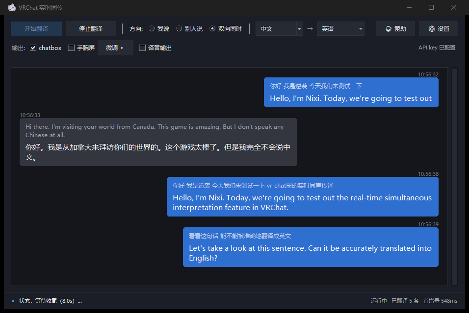

# VRChat 实时同传

> **中文** | [English](docs/README.en.md) | [日本語](docs/README.ja.md) | [한국어](docs/README.ko.md) | [Русский](docs/README.ru.md)

在 VRChat 里做**实时同声传译**：采集麦克风 / 游戏音频 → 千问云实时同传模型 →
译文送到 **chatbox 气泡**、**VR 手腕屏**，可选把译音回灌进虚拟麦克风**让对方直接听见**。

**Windows 10/11 与 Linux 都支持。** 两边共用同一份 `config.yaml`，配置语义一致。

---

> 🧭 **这份文档有三种读者**
>
> - **Windows 直接下 exe 的**：不需要 Python、不需要命令行。凡是出现 `.venv\Scripts\python.exe`、
>   `run_*.bat`、`--xxx` 的地方都是**源码安装专用**，跳过即可——你要的功能界面上都有。
> - **Windows 从源码跑的**：下面全部适用。
> - **Linux 用户**：看 **[GUIDE.linux.md](docs/GUIDE.linux.md)**（安装、依赖、虚拟声卡、
>   手腕屏、排障都是 Linux 专用的）；本文下面的 Windows 细节可以跳过。

## 它能做什么

| 功能 | 状态 | 说明 |
|---|---|---|
| ① 我说 → **chatbox 气泡** | ✅ 已实现，默认开启 | 麦克风 → 端到端语音翻译 → 首个增量立即发、之后每 2 秒刷一次快照、句末必发最终版 |
| ② 别人说 → **VR 手腕屏** | ✅ 已实现 | 采集 VRChat 播放输出（WASAPI loopback）→ 译成中文 → 渲染到 SteamVR overlay，**有更新就立刻上屏** |
| ③ 我说 → **译音进对方耳朵** | ✅ 已实现，默认关闭 | 模型直出译音 → 重采样 48kHz → 写进虚拟声卡 → VRChat 麦克风拾取。需自备虚拟声卡（VoiceMeeter / VB-Cable 等）。**「麦克风代理」默认开启**：程序运行期间一直占着虚拟声卡，VRChat 里麦克风固定选它，主界面一颗 `🎙 原声` / `🗣 译音` 按钮一键决定对方听到的是你的原声还是译音 |
| ④ 我说 → **打字替代说话** | ✅ 已实现，默认开启 | 界面底栏输入框，**回车即发**：不想开麦时用键盘代替麦克风，译文走的是和①**完全相同**的下游（气泡 / 手腕屏）；勾了「译音输出」时还会用 **TTS 把译文念出来**送进虚拟声卡（对方能听到） |
| ⑤ 几个人 → **互相看字幕（房间）** | ✅ 已实现，默认关闭 | 几个人**各自**跑一份本程序、填**同一个房间码**，就能在各自的手腕屏 / 桌面字幕上看到**彼此说的话**；只广播你自己说的话（游戏声音不会被转播）。入口：`⚙ 设置 → 房间` |

### 平台支持

| 功能 | Windows | Linux |
|---|---|---|
| ① chatbox 气泡 | ✅ | ✅ |
| ② VR 手腕屏 | ✅ SteamVR overlay | ✅ 自建 OpenXR overlay（Monado / WiVRn） |
| ③ 译音进对方耳朵 | ✅ 需自备虚拟声卡（VoiceMeeter / VB-Cable） | ✅ **不需要自备**，程序运行时自己声明虚拟麦克风 |
| ④ 打字替代说话（含 TTS） | ✅ | ✅ |
| ⑤ 多人房间（互相看字幕） | ✅ | ✅ |

Linux 的安装与用法：**[GUIDE.linux.md](docs/GUIDE.linux.md)** ·
设计依据与「哪些路试过不通」：**[docs/平台约束记录.md](docs/平台约束记录.md)**

---

---

## 📖 使用指南

### ChatGPT 订阅语音（源码预览）

新增「ChatGPT 订阅语音」路径，已实测中文语音 → 日文字幕及日文译音。
此路径使用官方 Codex CLI 的订阅语音连线，不需要 OpenAI API key；模型由服务端选择，
不能把它当成通用 API Credit，也不保证指定 `gpt-live` 型号可用。

1. 安装本项目的源码依赖、官方 Codex CLI，以及 Chrome 或 Edge。
2. 额外安装：`.venv\Scripts\python.exe -m pip install -r requirements-chatgpt.txt`。
3. 开启 GUI，在设置切换至「ChatGPT 订阅语音（消耗 Codex 额度）」，按「登录 ChatGPT」完成浏览器登录。
   本工具使用独立登录，首次使用需在界面登录；本机 `codex login` 不会自动共用。
   登录完成后显示「ChatGPT 已登录」，按钮改为「切换 ChatGPT 帐户」。
   凭证由官方 CLI 储存在用户数据目录的 `vrchat-livetranslate/codex/`，
   Windows 为 `%APPDATA%\vrchat-livetranslate\codex\`；换帐户不修改日常 Codex 登录。
4. 选择「我说」及中文 → 日本语，开始翻译。需要让 VRChat 玩家听见日文时，
   开启「译音输出」，设置虚拟声卡，并在 VRChat 选择其录音端作为麦克风。
   选「双向同时」可同时将你的中文转成日文、将对方的日文转成繁体中文字幕；
   日文译音只从「我说」方向送往虚拟麦克风，对方方向不输出声音。

支持单向及双向语音翻译，使用 Juniper 声音；打字翻译与 Qwen 声音预听不适用。
双向模式会建立两条独立语音连线，两个方向各自使用订阅额度。
语音连线会启动隔离的背景 Chromium，停止翻译时清理；不使用主浏览器的个人资料。
可用性及额度取决于登录帐户与 Codex 语音服务。现有下载版 exe 尚未包含此预览功能。

提示词防护机制、实测发现与验证边界见 [Findings](docs/ChatGPT-prompt-defense.md)。
耗用订阅额度的额外实机测试与资料仅保留本机，不随 repo、套件或 CI 发布；CI 只运行离线回归。

从**快速上手**到**已知限制**的完整内容（安装、API key、用法、配置、排障、项目结构、开发）都在单独文档里：

- **Windows** → **[使用指南（docs/GUIDE.md）](docs/GUIDE.md)**
- **Linux** → **[Linux 使用指南（docs/GUIDE.linux.md）](docs/GUIDE.linux.md)**
  （安装用 `./setup.sh`，启动用 `./run_gui.sh`）

---

## 🙏 许愿列表（Wishlist）

这里放的是**我想做、但自己不擅长 / 不会 / 不想自己做**的事。你如果看到哪条觉得「这个我能做」，
不用先问我，直接动手就行 —— 做完开个 issue 或者 PR 喊我一声，我把你的成果挂到这条下面。

> 📌 **这个列表会持续更新**：想到新的就往上加，做完的会移走（或者标上 ✅ 和作者）。
> 想第一时间看到新增，点个 Star 或者偶尔回来翻翻即可。

- [ ] **① 一份「怎么用」的教程视频** — 录制者不限，**语言不限**
      先自己把软件装好、完整跑通一遍（照着 [零、最快上手](docs/GUIDE.md#零最快上手下载现成的-exe) 走就行），
      然后录一个面向新手的教程：怎么下载安装、API key 填在哪里、怎么在 VRChat 里真正用起来。
      中文 / English / 日本語 / 한국어 / Русский 都可以；发在哪个平台、多长、什么风格都随你。

- [ ] **② 一份图文版教程** — **语言不限**
      同样是面向新手：用截图 + 文字，把「从下载到第一次翻译成功」的全过程讲清楚。
      博客文章、文档站、PDF、一条长帖都算数。

- [ ] **③ 母语者帮忙校对界面翻译** — 需要 日本語 / 한국어 / Русский / English 的母语者
      界面现在支持五种语言，但日/韩/俄三套词表是我的机翻 + 我这个非母语者手动过了一遍 ——
      **语感、敬体一致性、术语统一这些只有母语者看得出来**。做法很简单：把界面切到你的语言、
      正常用一用，把「翻错 / 不自然 / 看不懂」的地方配上截图开个 issue 就行；
      想直接改也可以：`vlt/locales/<语言>.py` 就是一张「中文原文 → 你的语言」的对照表，
      照着改、提 PR 即可，**不需要碰代码**。

不要求做得完美 —— 能让后来的人少踩一个坑，就算成功。

---

## ☕ 赞助

**请给我报销 token** 🙏

- ☕ **Ko-fi**（海外 / 信用卡 / PayPal）：

  

- 国内：微信 / 支付宝扫码

- 🔑 还没开通千问云？**[点此开通「千问云」▸](https://www.qianwenai.com/)**

> 图形界面顶栏也有「☕ 赞助」按钮，点开就是上面的入口。

---

## 许可

[MIT License](LICENSE) © 2026 Nixi
